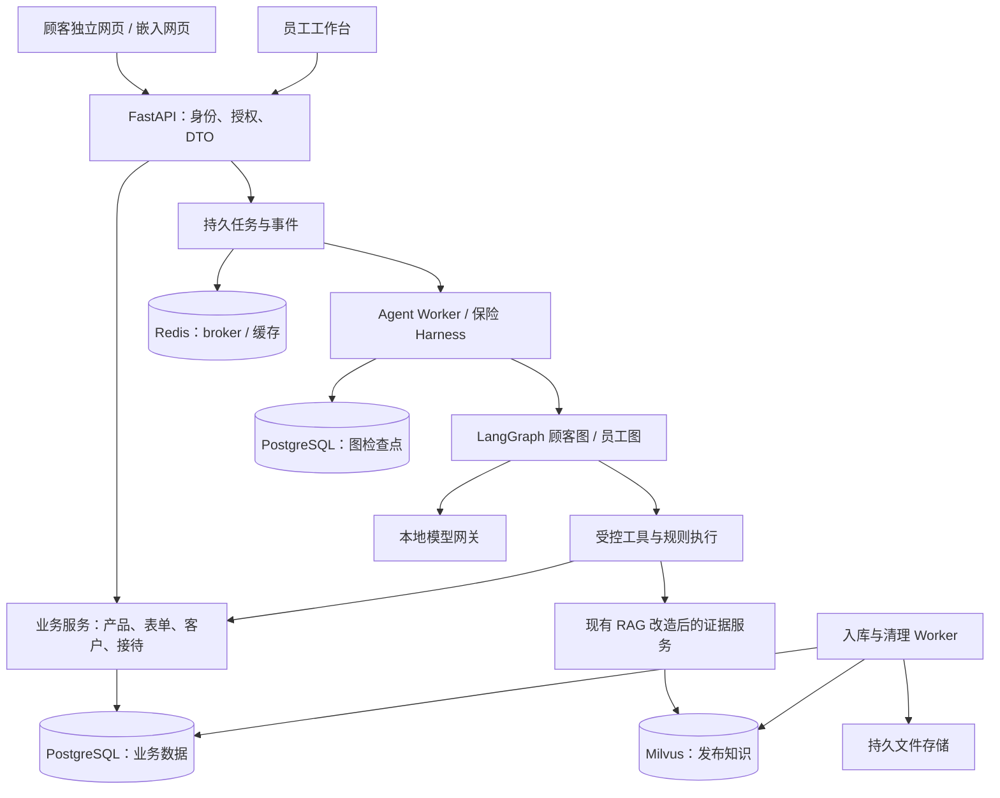

# InsureRAG 改造开发交接书

> 面向接手开发的 Agent：本文件可以独立阅读。先理解已确认边界、当前代码和验收标准，再实施；不要把设计中的模块当作现有功能，也不要重复询问用户已回答的问题。

编写日期：2026-10-08（Asia/Shanghai）。项目：InsureRAG。编写时仓库 HEAD：`0b5b1d9`。当前工作目录：`E:\InsureRAG\InsureRag`。下文代码路径均相对于仓库根目录，换电脑后不应硬编码此盘符。

当前进度：完成需求澄清和设计，尚未实施销售助手业务代码。本次交接只检查源代码与文档，没有运行应用、模型推理、业务测试或压测。仓库已有测试不等于当前环境已通过测试。读取机器硬件信息曾因权限不足失败，设备型号来自用户说明。

## 1. 目标与阅读规则

把当前“保险条款上传、检索、问答”的本地 RAG 系统，改造为可供保险服务商独立部署的双端销售助手：

**顾客了解产品 → 表达和确认需求 → 获得有依据的候选产品推荐 → 必要时转人工 → 员工在线接待并继续跟进。**

目标是真实客户业务试点，不以演示界面为最终完成标准。目前没有合作方，先开发产品，再寻找服务商。可用测试产品和虚构客户完成开发验证，但不得将这些数据包装为真实可售产品或实际业务结果。

文中标记：

- **[已确认]**：用户已经明确选择，实施时遵守，改变这些决定前询问用户。
- **[开发默认]**：为可执行性确定的实现方案；可在不改变范围和用户体验的前提下调整，说明理由并更新文档。
- **[待验证]**：需要硬件测试、真实资料或接入环境才能确定，不能用猜测代替验证。

如其他文档与本文冲突：用户后续明确指示优先；此前已确认的决定以本文第 2 节及 `docs/SALES_ASSISTANT_REQUIREMENTS.md` 为依据；技术细节以本文及 `docs/SALES_ASSISTANT_V1_SPEC.md` 为当前基线。`docs/SALES_ASSISTANT_ARCHITECTURE.md` 是架构参考，不可用其中的旧建议推翻用户已确认选择。代码说明“现在是什么”，规格说明“要变成什么”。

## 2. 已确认的产品决定：无需重新询问

| 项目 | 决定 |
| --- | --- |
| 服务对象 | 不同保险服务商；业务起点为保险公司销售助手，支持服务商自行配置资料 |
| 部署方式 | 每家服务商独立部署一套；不做共享 SaaS 平台 |
| 地区 | 第一版中国大陆；架构保留其他地区扩展能力，首版不验证其他地区 |
| 险种 | 不锁定单一险种，按服务商配置产品、字段和规则；不等于所有险种天然已可用 |
| 顾客入口 | 独立手机/电脑网页，同时可嵌入服务商网站或 App |
| 员工入口 | 电脑网页工作台 |
| 顾客登录 | 不强制登录，进入前统一展示资料表单，全部选填、可以跳过 |
| 核心业务 | 产品介绍、条款问答、信息采集、产品推荐、人工接待与后续跟进 |
| 推荐展示 | 直接向顾客展示候选产品和理由，不等待员工逐条审批 |
| 表单 | 服务商可配置基础需求与健康信息两类表单，分开管理 |
| 客户可见范围 | 机构内所有工作人员都可以查看全部客户，不能擅自改为只看自己客户 |
| 业务配置权限 | 所有工作人员都可维护并直接发布产品、知识资料、表单和推荐条件，不增加管理员审核关卡 |
| 人工分配 | 公共待接待列表，员工主动接单；同一事项只有一个当前负责人 |
| 人工服务形式 | 站内聊天，以及电话/微信后续跟进；后者首先是待办与联系结果记录 |
| 报价与投保 | 仅保留模块边界，后续有需求再做；首版不做真实或模拟执行 |
| Agent 技术路线 | 参考 Codex harness 设计，用 LangGraph 实现；不直接嵌入或 fork Codex |
| 长期记忆 | 不建设 Agent 长期记忆；保留当前会话状态、业务记录及必要历史 |
| 模型 | 仅服务商本地/内部网络模型，不调用外部模型 API；可接入微调后的模型 |
| 数据保存 | 聊天、客户资料、健康资料分别由服务商配置期限，支持到期清理及人工删除 |
| 当前资源 | 暂无服务器，先在电脑开发；用户有 RTX 4060 移动端和 RTX 4070 Ti 桌面端 |
| 试点规模 | 5 名员工、10 位顾客同时咨询；这是目标负载，不是性能承诺 |

明确不在首版范围：Agent 长期记忆服务/聊天向量记忆库、共享 SaaS 入驻与跨机构控制台、其他地区正式业务、小程序或原生 App SDK、自动拨号/自动发微信、正式报价/投保/支付/出单、外部模型兜底、模型微调训练平台、默认接入 CRM 或企业 SSO、自主多 Agent 团队。

“保留报价投保模块”只需稳定扩展边界和文档说明；不要注册可用工具、制作假报价、展示未接通的投保按钮或借此扩大第一版范围。微调后的模型是可能的推理输入，训练工作未获纳入范围。

## 3. 当前项目实际情况

### 3.1 可复用代码地图

| 当前文件/目录 | 已有职责 | 改造方向 |
| --- | --- | --- |
| `README.md`、`API.md`、`MCP.md` | 当前 RAG 使用说明 | 作为现有行为参考，实施后同步更新 |
| `config/settings.py`、`config/config.yaml` | YAML/环境变量配置 | 扩展数据库、队列、模型与部署配置，不把机构业务规则硬编码进去 |
| `api/main.py` | FastAPI 入口，根路由返回 `web/index.html` | 保留服务骨架，增加双端与身份接口 |
| `api/routes.py`、`api/schemas.py` | 查询、检索、文档上传/删除、状态和观测 API | 逐步封装领域服务，拆分顾客/员工 DTO |
| `api/auth.py` | 可选共享 API Key | 新增员工登录、匿名会话凭证、对象级授权 |
| `services/rag_service.py` | 问答、检索、缓存协调，条款详情与文档列表 | 抽取带资料版本/可见范围的证据服务 |
| `services/ingestion_service.py` | 上传 PDF 的保存、解析、建索引和删除 | 改为持久任务与版本化文档生命周期 |
| `stage1_load_split.py`、`parsers/` | PDF 文本与质量检测、OCR fallback | 复用；保持来源、页码与错误状态 |
| `chunking/parent_child_chunker.py` | 父子切块、条款 ID、文档 ID | 复用切分，改进文档及版本身份 |
| `stage2_build_db.py` | BGE-M3 编码、Milvus 建库及写入 | 改为旁路版本构建，避免破坏正在使用的知识 |
| `stage3_search.py`、`vectorstore/` | dense/sparse、RRF、父块去重、重排、连接重试 | 保留检索能力，加入发布版本和访问范围过滤 |
| `stage4_generate.py` | vLLM 文本生成、Trace、生成降级 | 分离通用 ModelGateway 与具体业务 prompt |
| `cache/cache_store.py` | Redis/JSON、精确/语义缓存 | 隔离客户数据，增加版本与权限范围，修正失效策略 |
| `observability/` | Trace、SQLite 观测存储、日志、指标、入库状态 | 复用可观测能力，增加业务关联 ID；不是新业务数据库 |
| `mcp_server/` | 暴露现有 RAG 工具 | 保留为适配层；内部 Python 调用不必绕 MCP |
| `web/index.html`、`dashboard/app.py` | 简单上传问答页面、观测页面 | 不是双端工作台；旧页面可保留为受控调试入口 |
| `stage6_evaluate.py`、`eval/eval_set.json` | 本地 RAGAS 评测 | 修正运行证据对应关系，再扩展业务评测 |
| `tests/unit`、`tests/integration`、`tests/e2e` | 切块、检索、缓存、API 等测试 | 建立原有回归基线，再新增业务测试 |

当前 `requirements.txt` 已有 FastAPI、OpenAI-compatible 客户端、LangChain 部分组件、Milvus、Redis、OCR、pytest 等；尚未声明 LangGraph、PostgreSQL 业务持久化、Celery 和新前端。`agents/`、`domain/`、`infra/`、`frontend/`、`migrations/` 是待建设目录，不能当作已存在模块。

现有配置快照：生成服务 `http://localhost:8002/v1`，模型 `Qwen/Qwen3-8B-AWQ`；Embedding 为 `BAAI/bge-m3`；重排为 `BAAI/bge-reranker-base`，两者配置为 CPU/local_files_only；Milvus 本机 19530，Redis 本机 6379，API 8000，Dashboard 8001。配置项可能被环境变量覆盖，存在配置不代表服务运行或模型已下载。不要复制开发用空密钥作为生产身份方案。

### 3.2 源码核实的改造缺口

以下为本次静态检查所得，接手后在当前版本复核；行号可能变化，以符号名定位。

1. **身份不足**：`api/auth.py::require_api_key` 只验证共享 Key；默认 `auth_enabled: false`。不能区分顾客、员工或客户归属。生产顾客界面不能直通现有调试/上传/Trace 接口。
2. **集合名不是业务权限**：`QueryRequest/SearchRequest` 接受 `collection`，`rag_service.resolve_collection` 用于选择集合。新 API 应接受产品/文档业务 ID，由后端授权后解析物理集合，不能让客户端指定集合绕过权限。
3. **详情和上传存储不统一**：`rag_service.get_clause_detail` 从 `data/chunks.json` 读取；上传路径 `ingest_pdf_file` 直接切块写 Milvus，不写该 JSON。上传后检索可命中不代表详情接口能找到同一条款。
4. **文档身份基于文件名**：`default_document_id` 与 `save_upload` 根据文件名派生身份。改成独立 document_id、document_version_id、内容哈希；文件重名不能等于同一产品版本。
5. **建索引可能破坏旧库**：`stage2_build_db.build_collection` 对同名集合先 drop。新入库使用暂存版本，成功校验后切换发布指针；不要为了调试直接运行脚本覆盖用户数据。
6. **删除结果可能不完整**：`ingestion_service.delete_document` 捕获 drop 异常后仍删除本地状态和目录。新设计应先撤销可见性，记录删除任务状态并重试，不能把残留索引误报为已完全删除。
7. **任务不持久**：上传通过 FastAPI `BackgroundTasks` 处理；进程退出不保证恢复。改为持久 job、Worker、幂等步骤及可查询失败状态。
8. **缓存缺少知识/权限版本**：缓存键未包含发布知识 revision、客户范围等；`query_insurance_clause` 可高相似度直接返回旧答案。个性化顾客回答首版禁用跨客户语义答案复用；知识更新、下架、撤权必须失效。
9. **生成还不是 Agent**：`stage4_generate.call_vllm` 只发送文本消息并读取文本流，没有工具执行循环、业务状态或结构化字段契约。新增工具调用不能只改 prompt。
10. **降级和日志需要顾客输出裁剪**：现有生成 fallback 包含异常信息，Trace 可含原始内容。新顾客 DTO 不返回内部错误、提示词、原始工具载荷或员工备注。
11. **评测存在二次检索**：`stage6_evaluate.collect_all_data` 先 `search` 取 contexts，再 `answer` 触发检索。改为读取同一 run 的答案和实际证据，避免评测错配。
12. **已有测试不等于真实 E2E**：部分 `tests/e2e` 使用 TestClient 与 mocked 检索/入库。需要补真实数据库、Worker 重放和本地模型联调，分别报告验证层次。

## 4. 目标架构及组件边界

**[开发默认]** 模块化单体，API 与 Worker 分进程，共用领域服务；无需先拆微服务或建设 Kubernetes 平台。



默认选型：FastAPI/Python；React + TypeScript 双端前端；PostgreSQL + SQLAlchemy/Alembic；LangGraph + PostgreSQL checkpointer；Redis + Celery；沿用 Milvus；文件存储先封装本地持久目录，保留对象存储接口。安装时验证版本兼容并生成锁定依赖，不在这里指定未经测试的包版本。

单机构独立部署仍需要 organization_id 范围和正确授权，但不需要完整 SaaS tenants/memberships/计费系统。不要同时引入多套编排框架。

### 4.1 Harness 应承担什么

- `context_builder`：装配本会话消息、当前事项已确认资料、有效证据、任务规则；按 token 预算裁剪。
- `tool_executor`：注册工具 schema，校验参数、角色和作用范围，执行超时/有限重试、裁剪结果。
- `policies`：当前身份授权、动作确认要求、预算、接待模式、发布状态；最终业务服务仍强制校验。
- `validators`：字段/schema、证据对应关系、产品版本、顾客可见内容检查。
- `events`：持久化进度、结果、失败和审计，顾客/员工使用不同响应投影。
- LangGraph：路由、有限循环、状态和 checkpoint、必要的暂停/恢复。不会自动替代业务事务、账号权限、接单分配或外部系统幂等。

模型可识别意图、抽取候选字段、改写查询、评估缺口、生成有证据的解释。程序负责授权、规则计算、字段校验、金额计算（如未来实现）、写入、状态切换、去重和发布。

## 5. 页面和完整用户流程

### 5.1 顾客端

最小页面/组件：入场资料页、聊天页、产品卡片及详情/引用、推荐结果与理由、动态表单、字段确认卡、人工状态、联系方式表单、历史消息及重试提示。

正常流程：打开 → 选填/跳过入场资料 → 询问或选择产品 → AI 查询/追问 → 确认资料 → 查看候选产品 → 继续咨询或申请人工 → 在线交流/留下后续联系信息。

**[开发默认]** 入场字段：昵称、年龄/年龄段、地区、咨询险种或保障需求；一律选填。不在此默认收集健康资料。联系信息在请求后续联系时选填，未填显示“暂无可用联系方式”，不伪造或强制跳回入场页。

来源引用定位到实际文档版本、页码/条款/片段；点击详情仍要授权。无资料时说明尚无依据，不用常识替代产品条款。

### 5.2 员工端

最小页面：登录、公共待接待列表、全部客户/事项列表、客户详情、人工聊天、员工 AI 辅助、跟进待办、产品与文档管理、表单与规则管理。管理员另有账号和部署设置。

员工流程：登录 → 主动接单 → 查看客户本次资料/消息/摘要 → 回复或使用 AI 草稿 → 记录跟进 → 转交、关闭或明确退回 AI 自助。

员工 AI 提供条款查询、需求摘要、缺口提示、候选产品解释和回复草稿。生成草稿与“发送给顾客”是不同动作。所有员工可查看机构客户，不等于可不经转交同时回复一个已分配会话。

### 5.3 默认身份与权限矩阵

| 动作 | 匿名顾客 | 普通工作人员 | 部署管理员 |
| --- | --- | --- | --- |
| 咨询公开产品 | 当前会话 | 可以 | 可以 |
| 查看客户业务资料 | 当前会话/事项授权范围 | 本机构全部 | 本机构全部 |
| 查看内部备注 | 不可 | 本机构共享 | 本机构共享 |
| 查看员工个人 AI 对话 | 不可 | 默认仅本人 | 默认不因管理员身份自动公开 |
| 发布产品/资料/表单/规则 | 不可 | 可以直接发布 | 可以直接发布 |
| 回复顾客 | 发送本人的消息 | 当前接待负责人 | 先接手/转交再回复 |
| 账号、运行配置、保留策略 | 不可 | 不可 | 可以 |

管理员的额外系统权限是开发默认；不得把它误用成产品发布审批。密码采用成熟哈希实现，账号停用后会话失效；不提交默认生产密码。

匿名凭证应随机、受限、有到期与撤销机制；customer_id/conversation_id 不是凭证。姓名/电话文本不证明身份，不自动匹配旧客户。首版只承诺同浏览器续接，不实现跨设备找回。

网站默认 iframe，App 默认 WebView。实施时处理允许来源、嵌入策略和浏览器第三方凭证限制；不能仅靠第三方 Cookie 假定可用。凭证不得放在可长期复制的 URL；宿主 origin 校验不代替资源授权。首版不依赖宿主 SSO，真实宿主联调是上线前验证项。

## 6. 产品目录、表单与推荐规则

### 6.1 产品/知识发布

产品至少包含名称、保险公司、险种、地区、销售状态、产品版本、公开/内部内容标记、关联文档版本、字段模板和推荐规则版本。文件只是证据来源，不等于完整产品目录。

**[开发默认]** 草稿 → 已发布 → 已下架；修订产生新版本。任一员工可明确点击发布，系统先做结构与来源检查，不增加独立审核人。模型从文档抽取信息只能形成草稿，不能自行发布。

新文档 PDF 解析/OCR/切块/编码进入持久 job。先构建暂存索引，验证计数、来源和可检索性后再切换有效版本。入库成功不自动等于产品对顾客发布。产品下架立即停止新推荐/查询，物理清理可异步重试。

### 6.2 字段与确认

字段 schema 至少支持 string、number、boolean、date、单选/多选、枚举、条件显示、类型校验、必填条件、用途说明和版本。规则基于稳定 field_id，不基于模型改写后的中文标签。

基础需求与健康回答分别存储/授权/清理；必要字段随险种和产品模板变化，不把整个系统写死为人身保险问卷。个人、家庭成员或其他投保对象的信息需有 subject 引用，不能把“替父亲问”的年龄写成顾客本人年龄。非人身险扩展字段通过模板描述；首版通用表单不代表已完成所有险种业务核验。

入场字段永远选填。产品流程中的必要字段可以追问；顾客不提供仍可一般咨询或转人工，但不能凭缺失值生成确定性推荐。

字段生命周期：候选 → 类型/业务校验 → 顾客确认（或员工明确记录来源）→ 业务事实版本 → 相关摘要/推荐失效。结构化表单明确提交即构成该内容的确认，不对同一提交重复追问。

建议保存：case_id、subject_id、field_id、value、source_message/form、confirmation_status、confirmed_by、confirmed_at、revision、适用范围。员工推断与客户自述分开，不能伪造顾客确认。

健康采集仅使用已发布模板并展示用途及确认说明；模型不自行扩展问题集。不在通用 prompt 中永久写入健康信息，不形成跨会话画像。

### 6.3 推荐的确定性契约

采用“程序筛选/排序 + 模型解释”。不得让模型自由编造产品、价格、适用条件或匹配分数。

1. 仅加载本机构已发布、顾客可见、适用地区的产品。
2. 根据当前事项已确认字段执行产品规则；规则来源及版本可追溯。
3. 硬规则为 PASS / FAIL / UNKNOWN 三态：缺少字段或规则依据不足为 UNKNOWN；不能转换为 PASS。
4. 配置支持等于、集合、数值范围、AND/OR；禁止任意 Python/JS 表达式执行。AND：任一 FAIL 则 FAIL，否则任一 UNKNOWN 则 UNKNOWN；OR：任一 PASS 则 PASS，否则任一 UNKNOWN 则 UNKNOWN。先明确缺失/null/类型错误处理并测试。
5. FAIL 候选排除；UNKNOWN 请求必要信息或展示一般介绍，不伪装为完成匹配。不存在可用规则时不把空规则解释为普遍适合。
6. 对 PASS 候选执行已配置偏好/优先级；没有排序依据时采用稳定目录顺序并如实表达，不称为最优。默认最多展示 3 项，其余可展开。
7. LLM 只基于匹配结果和对应产品证据生成理由、限制及未知事项。无匹配时说明无匹配，可调整需求或转人工。

预算只作为需求字段；没有对应价格依据时不假装满足预算。候选筛选不等于核保结果，不输出保证承保或保证赔付。产品/规则/客户字段修订后重新计算，保留当次所用版本用于解释历史结果。

可用虚构规则样例测试边界，但不得把样例年龄范围、健康问题或保障规则当作真实险种标准。

## 7. 会话、Graph State 与业务状态

三者分开：聊天会话保存交互；service_case 保存服务事项与责任；graph checkpoint 保存运行位置。完成一轮生成不等于关闭服务事项。

**[开发默认]** 一个顾客会话关联一个服务事项，员工辅助使用独立 graph_thread_id，通过 case_id 读取获授权业务资料。不要把员工原始 messages 混入顾客图。新会话默认不自动读取旧聊天；显式续接当前会话凭证只恢复原事项。将来增加跨会话关联时另行定义身份流程。

建议拆成独立状态字段，避免组合状态爆炸：

| 字段 | 值/职责 |
| --- | --- |
| case.lifecycle | open / closed |
| case.service_mode | ai / handoff_pending / human |
| case.assigned_staff_id | 当前唯一负责人，可为空 |
| followup.status | pending / completed / cancelled，跟进可与在线服务并存 |
| run.status | queued / running / waiting_confirmation / succeeded / failed / cancelled |

已有架构中的 self_service/queued/assigned 等名称可在实现时映射到此模型；保持行为一致即可，避免维护两套互相冲突的状态源。

Graph State 建议字段：conversation_id、case_id、recent_messages、summary_ref、confirmed_fact_refs、profile_revision、pending_field_changes、missing_fields、product_version_ids、rule_revision、knowledge_revision、evidence_refs、pending_action_id、expected_case_revision、retrieval_round、tool_calls、deadline、draft_response、validation_result、public_response、graph_version/prompt_version/model_version。

当前身份和授权来自可信运行上下文，不能由模型填充，也不能盲信旧 checkpoint 中的权限。保存动作与证据，不保存模型隐藏思维链。

顾客图主要分支：

- 产品问题：产品/版本确认 → 授权检索 → 缺口补查 → 草稿 → 事实/引用/展示检查 → 输出。
- 信息采集：模板与候选字段 → 校验 → 展示/确认 → 幂等保存 → 继续咨询。
- 推荐：读取确认字段 → 规则判断/追问 → 候选 → 对应证据 → 推荐解释校验 → 输出。
- 人工请求：幂等创建/更新事项 → 交接摘要 → 公共列表 → 状态事件。

每次顾客输入触发有限运行，答完本轮结束；不为每次追问都挂一个长期 interrupt。明确的待执行动作可用 pending_action/interrupt。LangGraph 恢复可能重放节点，业务写入必须独立幂等。

运行预算初值（可调、不是性能承诺）：最多 3 轮检索、8 次工具调用、60 秒执行期限；排队等待单独计时。重复无进展、依赖失败、证据不足时提前退出。顾客生成内容先检查再展示，公开进度事件可以先发送。

## 8. 人工交接、消息一致性与并发

1. 请求人工：事务更新 service_mode、创建/复用事项与摘要、写 outbox；重复点击不重复创建。
2. 接单：公共列表可见；用条件更新/版本检查原子设置负责人，多人同时接只能一人成功。
3. 进入人工：顾客 UI 展示接待状态；AI 可继续辅助员工，停止自动对顾客回复。
4. 防止竞态：模型开始生成时检查一次不够，实际写入/发送顾客答案前重新检查 case revision、服务模式和删除状态；旧运行结果抑制或取消。
5. 人工消息：持久化后通知，断线重连按事件游标续读；消息 ID 去重，不把事件重复投递变成重复聊天气泡。
6. 转交/关闭/退回自助：明确操作、版本校验、审计和顾客状态更新；不能由模型自行决定接待责任。
7. 无人接待：显示等待，不编造等待时间；提供可选联系方式并保留待办。没有联系方式则仍可在线等待，不虚报将电话联系。

同一会话同一时刻一个可写 Agent run。多人查看不等于并发写。请求使用 message_id、command_id/idempotency_key；同一键但载荷不同应冲突，不能悄悄复用旧结果。

业务写入和 outbox 同事务。事件投递可重复，消费者去重。不要假设业务事务与 LangGraph checkpoint 是一个跨组件原子事务；重放用 command_id 查询已有结果。

## 9. 数据模型和接口建议

以下是开发契约建议，不是已创建表或已存在 API。实施时可合理合并，但保留信息与约束。

### 9.1 数据分组

| 分组 | 核心实体/约束 |
| --- | --- |
| 机构与账号 | organization_settings、staff_users、staff_sessions；单机构部署，禁用账号可撤销登录 |
| 匿名访问 | visitor_sessions；凭证哈希/服务端会话，不以客户 ID 代替授权 |
| 客户与事项 | customers、subjects、service_cases；允许匿名客户，不能按姓名电话自动去重 |
| 交互 | conversations、messages、runs、run_events；会话内顺序、消息/命令幂等约束 |
| 采集 | form_templates、form_versions、responses、customer_facts、health_responses、field_change_requests |
| 产品知识 | products、product_versions、documents、document_versions、document_access、rule_versions、knowledge_revisions |
| 接待跟进 | case_assignments、followup_tasks、internal_notes；一个当前负责人 |
| 运行治理 | pending_actions、audit_events、outbox_events、ingestion_jobs、retention_policies、deletion_jobs |
| 检查点 | 独立 checkpoint schema；不是业务事实真相库，无长期记忆 Store schema |

公共字段按实体需要包含 organization_id、created_at/updated_at、revision、actor_id；数据库时间统一保存 UTC，展示按业务时区。只配置单机构也要防止组织标识来自不可信参数。

### 9.2 工具契约

工具返回结构化 success/error、适用范围、数据版本及必要证据，不把数据库连接或未裁剪结果交给模型。

| 工具/领域函数 | 行为与执行约束 |
| --- | --- |
| list_available_products | 后端过滤发布状态、地区和资料可见性 |
| search_product_evidence | 授权后检索已发布文档版本，限制补查次数 |
| get_clause_detail | 精确 document_version_id + parent_id，查详情再次授权 |
| compare_product_facts | 只比较有来源字段，缺失明确标记未知 |
| evaluate_product_candidates | 程序执行规则，返回三态、匹配理由、缺失字段与规则版本 |
| get_confirmed_profile | 当前事项授权的最新确认值，不返回其他会话历史 |
| propose_profile_changes | 只生成候选/确认请求 |
| commit_profile_changes | 校验确认内容/版本/主体，事务提交与审计 |
| request_handoff | 幂等更新服务事项与 outbox，返回真实接待状态 |
| create_followup_draft | 生成跟进草稿；保存/分配需明确业务动作 |

普通查询无需反复向顾客请求审批。字段确认和员工主动点击发布/发送属于明确动作；确认绑定具体内容、版本与有效期，不能让一句“好的”批准另一个已变更请求。

### 9.3 HTTP/事件接口示例

| 入口 | 建议接口 | 核心限制 |
| --- | --- | --- |
| 顾客 | POST `/api/customer/sessions` | 创建有限权限匿名会话、限流 |
| 顾客 | POST `/api/customer/conversations/{id}/messages` | 身份归属、message_id 去重，返回 run_id |
| 顾客 | GET `/api/customer/conversations/{id}/events` | SSE、事件游标、仅公开事件 |
| 顾客 | GET `/api/customer/conversations/{id}` | 历史消息/业务卡片，裁剪内部字段 |
| 顾客 | POST `/api/customer/profile-changes/{id}/confirm` | 内容和 revision 匹配 |
| 顾客 | POST `/api/customer/conversations/{id}/handoff` | 幂等请求人工 |
| 员工 | POST `/api/staff/auth/login` | 密码验证、会话建立 |
| 员工 | GET `/api/staff/cases` | 本机构全部，可按状态/负责人筛选 |
| 员工 | POST `/api/staff/cases/{id}/claim` | 原子接单；竞争失败返回可理解冲突 |
| 员工 | POST `/api/staff/cases/{id}/messages` | 当前负责人明确发送 |
| 员工 | POST `/api/staff/cases/{id}/assistant/messages` | 独立员工 AI 线程 |
| 员工 | POST `/api/staff/cases/{id}/transfer` | 负责人/管理员与版本检查 |
| 员工 | CRUD `/api/staff/products`、`forms`、`rules` | 草稿和版本；发布/下架为独立动作 |
| 员工 | CRUD `/api/staff/followups` | 负责人、预计时间、联系结果 |
| 管理 | `/api/admin/users`、`settings`、`retention` | 账号与部署配置，不是业务发布审核 |

初版使用 POST + SSE 即可支持人工聊天，不必为了“实时”立即引入 WebSocket。公开事件可包含 progress、form_request、profile_confirmation、product_card、recommendation、answer、citations、handoff_status、message、completed、error。每条事件至少有 event_id、conversation_id、created_at、type、经授权裁剪的 payload。SSE 重连不得重新启动模型任务。

错误需区分验证失败、未授权、资源不可访问、版本冲突、队列繁忙、依赖不可用；外部错误不泄露内部堆栈。旧 `/api/query` 等可暂留兼容，但生产访问范围必须收紧，不能形成旁路。

## 10. 数据保留与“无长期记忆”的准确含义

保留：本会话上下文和 checkpoints、业务确认资料、消息记录、可追溯交接/压缩摘要、产品知识。禁止默认自动学习长期偏好、跨会话语义召回、客户聊天向量化画像。产品知识向量库不等于客户长期记忆。

资料读取按已授权 case_id/customer_id 精确查询；摘要是派生数据，不覆盖正式问卷。需要继续原会话时恢复凭证和当前业务版本，不从旧 checkpoint 恢复过时身份或已撤回事实。

保留期限与计时起点按机构、按数据类别配置。不能把未配置解释为永久保存；具体天数由服务商确定，本文件不设未经确认的统一期限。

删除/更正范围包含业务字段、健康回答、消息、摘要、checkpoint、缓存、文件和相关索引；健康信息即使出现在普通聊天中，也不能绕过对应策略。审计尽量记录动作和摘要化元数据，不复制敏感正文。备份有单独保留规则及恢复后重放清理流程。

删除时阻止在途运行重新写入；需要 tombstone/版本机制，晚到结果不得复活数据。到期任务失败可查询和重试。真实数据模式启用前要求保留策略配置完成；开发使用虚构资料。

## 11. 本地模型与开发部署

**[已确认]** 全链路本地：生成、Embedding、重排以及涉及模型的 OCR 不默认接外部服务，评测/观测也不将客户原文上传外部模型。安装依赖或获取模型文件与“调用外部模型处理客户资料”是不同事项；实际下载受开发环境权限和用户约束控制。

**[开发默认]** 4070 Ti 桌面端优先作推理与负载测试设备；4060 移动端用于日常开发和轻量测试。不要仅凭型号假定显存、主存或运行状态，不承诺某参数量模型在该设备必然达到目标并发。

现有 Qwen3-8B-AWQ 作为能力评测起点，不是锁死选型。先验证结构化输出、中文需求提取、字段更正、证据解释、上下文长度及延迟，再决定是否换更小模型或需要微调。微调不能代替版本化知识、权限和确定性规则。

ModelGateway 区分文本生成、结构化结果与工具调用。原生 tool calling 不稳定时可采用枚举动作 JSON + schema 校验 + 确定性分发，有限修复失败后澄清/人工。框架支持某能力不代表当前模型服务已配置相应解析器。

设置有界推理队列和可调模型并发；10 位顾客在线不等于必须同时执行 10 路 GPU 推理。员工 AI 与顾客请求共享资源预算，人工聊天和账号接口不应因模型忙被阻塞。排队/执行超时分别记录，取消不能造成重复发送。

需实测记录：具体 GPU/显存/内存、操作系统、容器/WSL 环境、模型及量化、上下文预算、队列与并发参数、Embedding/重排资源占用。不要在不兼容平台强行安装运行栈；先选择适合实际环境的本地服务部署方式。

## 12. 实施顺序与每阶段完成定义

优先交付可运行的纵向流程，每阶段包含必要测试与说明，不一次性建立大量空目录假装完成。

| 阶段 | 建设内容 | 完成证据 |
| --- | --- | --- |
| P0 基线 | 复核仓库、依赖/服务、现有测试、现有数据备份与迁移边界 | 记录通过/失败/未执行项，不破坏现有索引 |
| P1 业务骨架 | PostgreSQL 迁移、机构配置、员工账号、匿名会话、双端页面 | 可登录/跳过入场并创建会话，归属授权可测 |
| P2 产品与知识 | 产品目录、版本、文档持久任务、表单/规则编辑发布、授权检索 | 任一员工可发布，草稿不可检索，下架与缓存失效正确 |
| P3 Agent 闭环 | ModelGateway、LangGraph/harness、问答、采集确认、推荐 | 一条完整产品咨询→资料确认→推荐路径；可解释失败 |
| P4 人工服务 | 公共接单、在线聊天、转交/关闭/退回、跟进、员工 AI | 并发抢单正确，AI/人工不争抢输出，消息可续读 |
| P5 可靠与交付 | 重放、清理、嵌入、部署、观测和评测 | 自动化回归、真实本地模型与宿主联调报告 |
| P6 试点验证 | 真实资料核实、目标设备压测、服务商配置、恢复演练 | 满足试点验收；未达标项明确，不把开发通过当上线完成 |

P1 起实现基本授权、日志裁剪和字段版本；不能把这些都推迟到 P5。P5 是系统级验证和完善。模型不可用时可用测试替身开发流程，但对外明确不可用，不在真实顾客端伪造答案。

建议目录（待建设，可按真实代码调整）：

```text
agents/
  customer_graph.py
  staff_graph.py
  state.py
  harness/             # context_builder / tool_executor / policies / validators / events
  nodes/
  tools/
  prompts/
domain/                # products / forms / customers / conversations / cases / rules
services/
  evidence_service.py
  profile_service.py
  recommendation_service.py
  case_service.py
  model_gateway.py
infra/                 # database / checkpointer / repositories / events / files
workers/               # agent_tasks / ingestion_tasks / outbox_tasks / cleanup_tasks
migrations/
frontend/              # customer / staff / shared
tests/                 # 保留现有；新增 authorization / graph / recovery / business_acceptance
```

新增依赖需锁定、说明兼容性；读官方框架文档验证实际 API。先建立现有数据迁移方案，旧 JSON/SQLite Trace 不应无脑当新业务数据导入。索引迁移、删除和重建须区分开发测试数据与用户已有资料。

## 13. 验收清单

### 13.1 必须具备的自动化/集成场景

- [ ] 跳过全部入场字段仍能咨询，顾客 A 无法读 B 会话、事件或资料。
- [ ] 输入相同电话不自动关联另一会话；失效/撤销凭证不能继续访问。
- [ ] 所有员工能查看机构全部客户、直接发布业务配置；无隐含管理员审批。
- [ ] 员工个人 AI 对话、内部备注、工具原文不会进入顾客 DTO。
- [ ] PDF 上传、检索、详情和引用使用一致的文档版本，重名文件可区分。
- [ ] 草稿不可对外查询，下架/撤权/新版本发布后旧缓存不再绕过边界。
- [ ] 未确认字段不变成正式事实；更正使旧推荐和派生摘要失效。
- [ ] 三态规则边界、缺失值、范围与 AND/OR 有真实业务意义的测试；空规则不产生确定性适合结论。
- [ ] 无证据/无候选/不愿提供字段时有明确降级，无虚构价格或承保结果。
- [ ] 重复消息、确认、工单命令不产生重复副作用；同键异载荷被识别。
- [ ] 两员工竞争接单仅一人成功；转交与旧负责人发送之间的竞态可验证。
- [ ] 员工接手后，已启动但未完成的 AI 不能再自动发送顾客消息。
- [ ] Worker 崩溃/重启/节点重放不重复写入或发送；SSE 重连只续读。
- [ ] 模型失效有限退出、不调用外部模型，人工聊天仍可工作。
- [ ] 健康模板按发布版本采集，回答来源及确认可追溯。
- [ ] 到期/人工删除涵盖副本；旧 checkpoint、在途结果和恢复流程不能复活资料。
- [ ] 指定测试宿主中的嵌入模式和独立页面都可用，不串会话。
- [ ] 文件/检索结果中的指令不会提高权限或触发未确认写入。

### 13.2 模型与负载验收

以同一次真实运行的回答和证据评测；分别统计事实与引用、字段抽取/更正、推荐理由准确性、采集完成和交接完整性。现有 RAGAS 集不能代替销售流程验收；不把同一模型自评当唯一正确性依据。

负载至少包括：5 员工在线 + 10 顾客会话、10 顾客同时发问、员工 AI 与顾客请求竞争、模型长响应期间人工发消息。报告排队时间、首个公开进度、最终答案耗时、成功率、资源峰值与失败原因。

性能秒数与模型质量阈值尚未得到用户/试点方确认，实施 Agent 应先测出基线并提出可复现指标，再确认实际服务期望；不能声称已满足未知 SLO。所有关键身份、幂等、状态与删除测试必须通过才进入试点。

## 14. 接手后可以执行的初始检查

这些是下一位 Agent 的工作建议，本次未执行以下业务测试。先确认所用解释器/虚拟环境；README 中其他电脑的绝对 Python 路径不能直接沿用。

```powershell
git status --short
python --version
python -m pytest tests/unit -q
python -m pytest tests/integration tests/e2e -q
```

测试可能需要安装依赖或读写临时数据；记录缺失依赖与失败，不能将 skip 当通过。有些测试依赖替身，因此通过不证明 Milvus/vLLM 实际可用。不要为了通过测试擅自下载大型模型或清空已有集合。

在环境及数据安全确认后，现有启动入口供参考：

```powershell
python -m uvicorn api.main:app --host 127.0.0.1 --port 8000
docker compose -f docker-compose.milvus.yml up -d
docker compose -f docker-compose.redis.yml up -d
```

执行前检查端口、容器、卷和配置，避免与已运行实例冲突。新架构需追加 PostgreSQL/Worker 等部署配置；现有 Compose 不是完整目标部署包。本文件不要求现在运行这些命令。

## 15. 仍需验证或询问的事项

目前没有必须先由用户回答才能开始业务代码的未决问题。以下按发生时处理：

| 项目 | 当前状态 | 下一步 |
| --- | --- | --- |
| 显存/内存/运行栈 | 知道显卡型号，未核实资源与服务 | 实测；无法读取时只询问缺失信息，不重复问已知型号 |
| 最终模型/是否微调 | 本地模型确定，具体选型未定 | 做能力与负载基线；训练是独立范围，不自动开展 |
| 产品及健康问卷内容 | 无合作方正式资料 | 测试资料开发；真实上线前由服务商核实 |
| 资料保存期限 | 已决定机构可配置，未指定天数 | 实现配置/清理；实际部署方设置，不编造统一期限 |
| 嵌入宿主 | 独立页+嵌入已确认，域名/App 未提供 | 测试宿主验证协议；真实域名接入时联调 |
| 上线性能标准 | 5 员工/10 顾客目标确定，时延未定 | 先实测，再确认可接受响应与排队时间 |

以下变化需要向用户提问而非自行决定：改成共享 SaaS、限制员工只能看自己的客户、增加产品管理员审批、强制顾客登录或入场必填、外部模型调用、报价/投保执行、长期记忆、微调训练任务、重大部署成本或开发范围扩张。

其他目录命名、组件封装和兼容性修复按开发默认自主推进，不为每个细节打断用户。交接文件本身不授权对外部署、发送客户消息或提交保险业务；实际执行遵循用户交付的开发任务及环境权限。

## 16. 接手 Agent 的交付要求

1. 先报告当前基线和准备实施的阶段，不重复需求问卷。
2. 保留现有可复用 RAG 能力和原有有意义的测试；迭代改造，避免无理由整库重写。
3. 每阶段给出变更、实际测试、未验证项及运行方式；不把配置文件、假数据或测试替身称为真实集成完成。
4. 更新数据库迁移、配置示例和启动说明，不能只留下孤立后端或静态前端。
5. 实施中的发现和已完成事项更新本文或关联进度记录，避免后续 Agent 误以为所有模块仍未实现。
6. 最终以第 13 节及真实试点前依赖核查交付，不以“页面能打开”作为项目完成。

现有参考文件：`docs/SALES_ASSISTANT_REQUIREMENTS.md`（用户决定）、`docs/SALES_ASSISTANT_V1_SPEC.md`（V1 基线）、`docs/SALES_ASSISTANT_ARCHITECTURE.md`（架构细节）。本文件已经整合继续开发所需的核心上下文，阅读这些文件是补充核对，不是理解本文的前提。

框架官方参考（实施时重新核对版本）：[LangGraph](https://docs.langchain.com/oss/python/langgraph/overview)、[Persistence](https://docs.langchain.com/oss/python/langgraph/persistence)、[Interrupts](https://docs.langchain.com/oss/python/langgraph/interrupts)、[vLLM Tool Calling](https://docs.vllm.ai/en/latest/features/tool_calling/)、[Codex harness 设计介绍](https://developers.openai.com/blog/codex-as-a-platform)。这些链接是参考，本文没有声称逐模块复用或审查 Codex 源码。
