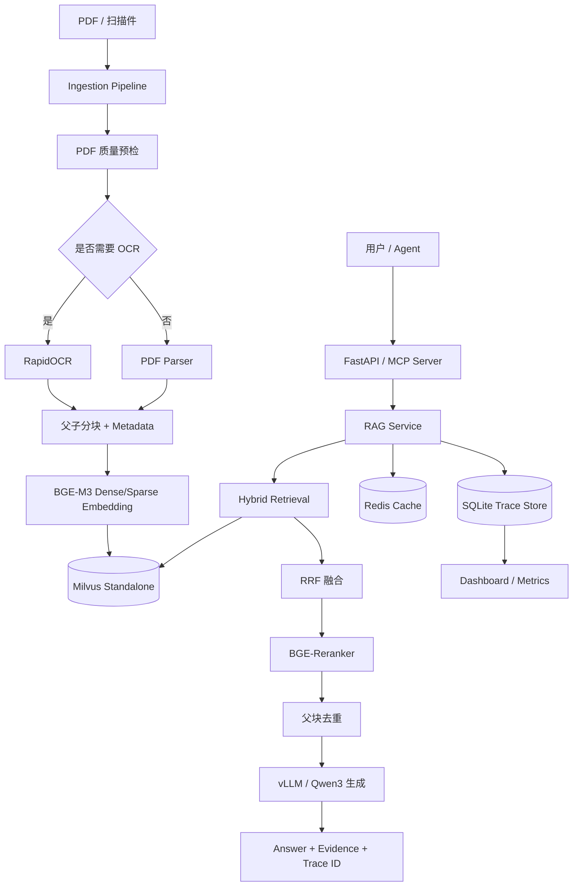

# InsureRAG

InsureRAG 是一个面向保险条款解析与理赔规则问答的本地化 RAG 服务。项目支持 PDF 质量预检、OCR fallback、父子分块、BGE-M3 Dense/Sparse 混合检索、RRF 融合、BGE-Reranker 重排、vLLM/Qwen3 本地生成、FastAPI、MCP Server、Dashboard、Trace、Metrics、Redis 缓存和 RAGAS 评测。

本项目定位为个人学习与面试展示项目，不宣称生产级准确率或生产级权限体系。

## 项目功能

- 保险条款 PDF 解析与质量预检。
- 图片型 PDF 或低质量文本层自动触发 OCR fallback。
- 按“第 X 条”条款结构进行父子分块，子块用于召回，父块用于生成上下文。
- BGE-M3 同时生成 dense / sparse 向量。
- 使用 Milvus Standalone 存储向量和条款元数据。
- Dense/Sparse 双路召回，RRF 融合后使用 BGE-Reranker 精排。
- 最终上下文阶段进行父块去重，减少重复条款占用上下文窗口。
- 使用本地 vLLM / Qwen3-8B-AWQ 生成答案。
- Prompt 约束模型仅依据召回条款回答，并过滤 thinking 输出。
- 支持 FastAPI HTTP 服务和轻量 Web 上传问答页面。
- 支持 MCP Server，将保险条款检索与问答封装为 Agent 可调用工具。
- 支持 TraceContext、SQLite trace store、Metrics、结构化日志和健康检查。
- 支持 Redis 精确答案缓存、语义答案缓存、语义检索缓存，并保留 JSON fallback。
- 支持 RAGAS 本地评测，裁判 LLM 使用本地 vLLM，避免连接 OpenAI。
- 提供 pytest 单元测试、集成测试和 API 测试。

## 技术栈

| 类别 | 技术 | 用途 |
| --- | --- | --- |
| 语言 | Python 3.12 | 项目主要开发语言 |
| PDF 解析 | LangChain / PyPDFLoader / PyMuPDF | PDF 文本抽取与页面处理 |
| OCR | RapidOCR / ONNXRuntime | 扫描件或图片型 PDF fallback |
| Embedding | BGE-M3 | Dense/Sparse 向量生成 |
| 向量数据库 | Milvus Standalone | 向量、稀疏向量和元数据存储 |
| 检索 | Dense/Sparse Hybrid Retrieval | 双路召回 |
| 融合 | RRF | 稠密/稀疏召回结果融合 |
| 重排 | BGE-Reranker CrossEncoder | TopK 精排 |
| 生成模型 | Qwen3-8B-AWQ | 本地答案生成 |
| 模型服务 | vLLM | OpenAI-Compatible API |
| 服务接口 | FastAPI / Uvicorn | HTTP API 和 Web 页面 |
| Agent 工具 | MCP Server / FastMCP | 将 RAG 能力暴露给外部 Agent |
| 缓存 | Redis / JSON fallback | 答案缓存、语义缓存、检索缓存 |
| 可观测 | Trace / Metrics / logging / SQLite | 链路追踪、指标统计、日志 |
| 评测 | RAGAS | 忠实度、相关性、上下文质量等评估 |
| 测试 | pytest | 单元、集成、API 测试 |
| 部署 | Docker / Docker Compose | Milvus、Redis、API 示例部署 |

## 系统架构



## 分层设计

```text
用户入口层：FastAPI / Web / MCP Server / Dashboard
业务服务层：services/rag_service.py / services/ingestion_service.py
检索生成层：stage3_search.py / stage4_generate.py
入库处理层：stage1_load_split.py / stage2_build_db.py
解析分块层：parsers/ / chunking/
存储层：Milvus Standalone / Redis / SQLite trace store / local JSON
可观测层：observability/
评测测试层：stage6_evaluate.py / eval/ / tests/
```

## 项目目录

```text
InsureRAG/
├── api/                         # FastAPI 路由、schema、API Key 鉴权
├── cache/                       # Redis / JSON 缓存实现
├── chunking/                    # 父子分块逻辑
├── config/                      # YAML + .env 统一配置
├── dashboard/                   # 本地 Dashboard
├── eval/                        # RAGAS 评测集
├── mcp_server/                  # MCP Server 和 tools
├── observability/               # trace、metrics、health、logging、error codes
├── parsers/                     # PDF 质量预检
├── services/                    # RAG service 与 ingestion service
├── tests/                       # unit / integration / e2e tests
├── vectorstore/                 # Milvus client 复用与断线重试
├── web/                         # FastAPI 内置轻量前端
├── stage1_load_split.py         # PDF 解析、质量预检、OCR、分块
├── stage2_build_db.py           # 建库、embedding、写入 Milvus
├── stage3_search.py             # Hybrid retrieval、RRF、reranker、fallback
├── stage4_generate.py           # vLLM/Qwen3 生成与 thinking 过滤
├── stage6_evaluate.py           # RAGAS 评测
├── docker-compose.milvus.yml    # Milvus Standalone
├── docker-compose.redis.yml     # Redis
├── docker-compose.api.yml       # API 容器示例
├── Dockerfile                   # API 镜像示例
├── requirements.txt
└── README.md
```

## 核心流程

### 1. 文档入库

```text
PDF
-> 提取前几页文本
-> 计算有效字符率与文本密度
-> 判断是否图片型 PDF / 低质量文本层
-> 必要时使用 RapidOCR fallback
-> 按条款结构父子分块
-> 写入 document_id、collection、page、clause_id、parent_id 等元数据
-> 使用 BGE-M3 生成 dense / sparse embedding
-> 写入 Milvus Standalone
-> 保存 ingestion trace
```

质量阈值：

| 有效字符率 | 行为 |
| --- | --- |
| `>= 0.80` | 质量较好，正常入库 |
| `0.60 - 0.80` | 可入库，但打印 warning，建议人工抽查 |
| `< 0.60` | 高风险，建议拒绝入库或触发 OCR fallback |

### 2. 问答链路

```text
question
-> exact / semantic cache check
-> BGE-M3 query embedding
-> dense search
-> sparse search
-> RRF fusion
-> BGE-Reranker rerank
-> parent dedup
-> prompt assembly
-> vLLM / Qwen3 generation
-> answer + evidence + trace_id
-> save trace / metrics / cache
```

### 3. 降级机制

| 失败阶段 | 降级策略 |
| --- | --- |
| PDF 解析失败 | 尝试 OCR fallback |
| Dense 检索失败 | 使用 Sparse-only fallback |
| Sparse 检索失败 | 使用 Dense-only fallback |
| RRF 融合失败 | 回退到原始召回结果 |
| Reranker 失败 | 回退到 RRF TopK |
| LLM 生成失败 | 返回检索证据片段和错误提示 |
| Redis 不可用 | 回退到本地 JSON cache |
| Milvus 连接失效 | 清空旧 client 并重试一次 |

## 配置说明

项目使用统一配置管理：

- [config/config.yaml](config/config.yaml)
- [.env.example](.env.example)

配置优先级：

```text
代码默认值 < config/config.yaml < .env / 环境变量
```

常用配置：

```yaml
llm:
  base_url: http://localhost:8002/v1
  model: Qwen/Qwen3-8B-AWQ

vector_db:
  host: localhost
  port: 19530
  collection: insure_rag

retrieval:
  dense_top_k: 20
  sparse_top_k: 20
  final_top_k: 5

api:
  host: 0.0.0.0
  port: 8000
  auth_enabled: false

cache:
  backend: redis
  redis_url: redis://localhost:6379/0
```

公开环境不要使用默认安全配置。至少开启：

```env
INSURERAG_API_AUTH_ENABLED=true
INSURERAG_API_KEY=your-private-api-key
```

开启后访问业务 API 需要请求头：

```text
X-API-Key: your-private-api-key
```

## 环境准备

建议使用当前项目环境：

```text
D:\software\conda\envs\Agent_work\python.exe
```

安装依赖：

```powershell
pip install -r requirements.txt
```

依赖的外部服务：

- Docker Desktop
- Milvus Standalone
- Redis
- vLLM / Qwen3-8B-AWQ

## 启动 Milvus

```powershell
docker compose -f docker-compose.milvus.yml up -d
```

默认地址：

```text
http://localhost:19530
```

## 启动 Redis

```powershell
docker compose -f docker-compose.redis.yml up -d
```

默认地址：

```text
redis://localhost:6379/0
```

如果 Redis 未启动，且 `cache.fallback_to_json=true`，项目会回退到 `data/cache.json`。

## 启动 vLLM / Qwen3

项目默认使用：

```text
base_url: http://localhost:8002/v1
model: Qwen/Qwen3-8B-AWQ
```

示例：

```powershell
docker run --gpus all --name vllm-qwen3-8b-awq `
  -p 8002:8000 `
  -v D:\path\to\huggingface-cache:/root/.cache/huggingface `
  vllm/vllm-openai:latest `
  --model Qwen/Qwen3-8B-AWQ `
  --trust-remote-code `
  --gpu-memory-utilization 0.85 `
  --max-model-len 8192
```

## 文档入库

将保险条款 PDF 放到 `data/` 目录，然后执行：

```powershell
python stage1_load_split.py
python stage2_build_db.py
```

入库产物：

- `data/chunks.json`
- Milvus collection
- `traces/ingestion/*.json`

注意：当前 CLI 入库是重建式入库，`stage2_build_db.py` 每次运行会 drop 并重建 collection，不支持单文档增量插入、更新、删除。上传接口会为每份上传 PDF 建立独立 `upload_<hash>` collection。

## 启动 FastAPI

```powershell
python -m uvicorn api.main:app --host 0.0.0.0 --port 8000
```

接口文档：

```text
http://127.0.0.1:8000/docs
```

Web 上传问答页面：

```text
http://127.0.0.1:8000/
```

Web 页面流程：

```text
上传保险 PDF
-> 后台异步解析、分块、向量化、写入 Milvus
-> 轮询入库状态
-> 入库完成后基于该 PDF 对应 collection 问答
```

### Docker 运行 API

构建镜像：

```powershell
docker build -t insurerag-api:latest .
```

运行：

```powershell
docker run --rm -p 8000:8000 --env-file .env insurerag-api:latest
```

也可以使用：

```powershell
docker compose -f docker-compose.api.yml up --build
```

### Docker localhost 注意事项

容器内的 `localhost` 指向容器自身，不是宿主机。如果 API 在 Docker 容器内，而 vLLM / Milvus / Redis 跑在宿主机上，需要使用：

```env
INSURERAG_LLM_BASE_URL=http://host.docker.internal:8002/v1
INSURERAG_VECTOR_DB_HOST=host.docker.internal
INSURERAG_CACHE_REDIS_URL=redis://host.docker.internal:6379/0
```

Windows / macOS Docker Desktop 默认支持 `host.docker.internal`。Linux 环境通常需要额外配置 `host-gateway`，本项目的 `docker-compose.api.yml` 已给出示例。

## API 示例

健康检查：

```powershell
curl http://127.0.0.1:8000/health
```

检索 + 生成：

```powershell
curl -X POST http://127.0.0.1:8000/api/query `
  -H "Content-Type: application/json" `
  -d "{\"question\":\"等待期内生病了能赔吗？\",\"collection\":\"insure_rag\",\"top_k\":5}"
```

只检索：

```powershell
curl -X POST http://127.0.0.1:8000/api/search `
  -H "Content-Type: application/json" `
  -d "{\"question\":\"等待期内生病了能赔吗？\",\"collection\":\"insure_rag\",\"top_k\":5}"
```

主要接口：

| Method | Path | 说明 |
| --- | --- | --- |
| `GET` | `/health` | 健康检查 |
| `POST` | `/api/query` | 检索 + 生成答案 |
| `POST` | `/api/search` | 只检索，不生成 |
| `POST` | `/api/upload` | 上传 PDF，后台入库 |
| `GET` | `/api/upload/{document_id}/status` | 查询上传入库状态 |
| `GET` | `/api/uploads` | 查看上传文档 |
| `DELETE` | `/api/uploads/{document_id}` | 删除上传文档 |
| `GET` | `/api/documents` | 查看文档列表 |
| `GET` | `/api/traces/{trace_id}` | 查看查询 trace |
| `GET` | `/api/ingestion-traces` | 查看入库 trace |
| `GET` | `/api/metrics` | 查看指标统计 |

上传限制：

- 默认最大上传大小：`50 MB`
- 默认上传文档数量上限：`20`
- 默认只允许 `.pdf`
- 可通过 `config/config.yaml` 或环境变量覆盖

## 启动 MCP Server

MCP Server 使用 stdio 方式，适合被外部 Agent 调用：

```powershell
python -m mcp_server.server
```

暴露工具：

| Tool | 说明 |
| --- | --- |
| `query_insurance_clause` | 输入自然语言问题，返回答案、依据和 trace_id |
| `search_related_clauses` | 只检索相关条款，不生成答案 |
| `get_clause_detail` | 根据 clause_id / parent_id 查询完整条款 |
| `list_documents` | 返回当前知识库文档列表 |

示例 MCP client 配置：

```json
{
  "mcpServers": {
    "insurerag": {
      "command": "D:\\software\\conda\\envs\\Agent_work\\python.exe",
      "args": ["-m", "mcp_server.server"],
      "cwd": "D:\\code\\PythonProject\\InsureRAG"
    }
  }
}
```

更多说明见 [MCP.md](MCP.md)。

## 启动 Dashboard

```powershell
python -m dashboard.app
```

默认地址：

```text
http://127.0.0.1:8001
```

Dashboard 展示：

- Overview
- Metrics
- Document Browser
- Query Trace
- Ingestion Trace

## 可观测性

每次 `/api/query` 会记录：

```text
trace_id
question
dense_results
sparse_results
rrf_results
rerank_results
final_context
answer
latency
metadata
errors
created_at
```

结构化请求日志字段：

```text
trace_id, question, latency_ms, cache_hit, cache_type,
retrieval_mode, rerank_mode, generation_mode, error_type
```

日志位置：

```text
logs/insurerag.log
```

查询 trace 默认保存到 SQLite：

```text
traces/traces.db
```

ingestion trace 保存到：

```text
traces/ingestion/
```

统一错误码：

```text
PDF_PARSE_ERROR
OCR_ERROR
MILVUS_SEARCH_ERROR
RERANKER_ERROR
LLM_TIMEOUT
CACHE_ERROR
```

## 缓存机制

项目默认使用 Redis，并保留 JSON fallback。

```text
Redis: redis://localhost:6379/0
JSON fallback: data/cache.json
```

缓存分三层：

1. Exact Answer Cache：完全相同的问题、collection、top_k 和模型配置直接命中。
2. Semantic Answer Cache：语义相似度达到阈值，并且 collection、top_k、模型配置一致时命中。
3. Semantic Retrieval Cache：语义相似但不直接复用答案时，可复用检索结果，再重新生成答案。

为避免“问题相似但证据不同”导致错误命中，语义答案缓存还会校验：

- collection 是否一致
- top_k 是否一致
- 模型和检索配置是否一致
- evidence overlap 是否达到阈值
- top1 evidence 是否一致
- 原缓存答案是否没有 fallback 错误

当前语义缓存采用 Redis 集合扫描 + Python 余弦相似度计算，适合本地演示。生产化可以升级为 Redis Vector、FAISS 或独立 Milvus query-cache collection。

## 测试

运行单元测试：

```powershell
pytest tests/unit -q
```

运行集成和端到端测试：

```powershell
pytest tests/integration tests/e2e -q
```

运行全部测试：

```powershell
pytest -q
```

测试覆盖：

- PDF 质量预检
- OCR fallback 触发条件
- 父子分块 metadata
- RRF 融合
- 父块去重
- thinking 输出过滤
- Milvus 断线重试
- 缓存三层命中逻辑
- 检索 fallback
- FastAPI `/api/query`
- FastAPI `/api/upload`

## RAGAS 评测

评测集位于：

```text
eval/eval_set.json
```

运行：

```powershell
python stage6_evaluate.py
```

评测指标：

- Answer Correctness
- Faithfulness
- Answer Relevancy
- Context Precision
- Context Recall
- 平均响应延迟

当前本地阶段性结果：

```text
样本数：80
模型：Qwen/Qwen3-8B-AWQ
Answer Correctness: 约 0.74
Faithfulness: 约 0.83
Context Precision: 约 0.92
Context Recall: 1.00
平均响应：约 5.7s
```

说明：评测集规模有限，结果只用于本地样本对比和迭代优化，不应作为生产准确率。

## 项目特点

- 完整覆盖 RAG 入库、检索、生成、评测链路。
- 使用真实保险条款 PDF，而不是手写示例文本。
- 从 Milvus Lite 迁移到 Milvus Standalone，更接近服务化部署形态。
- 通过 MCP Server 将 RAG 能力封装为 Agent 可调用工具。
- 支持 trace_id 追踪一次问答中的检索、重排、生成、缓存和错误。
- 有降级机制，单个组件失败时尽量返回可用证据。
- 有缓存、metrics、健康检查和结构化日志，便于演示工程化能力。

## 项目限制

- Milvus 使用本地 Standalone，不是生产集群。
- CLI 入库仍是重建式入库，不支持完整文档生命周期管理。
- 多 collection / 多文档管理是基础能力，不包含复杂权限隔离和租户管理。
- API Key 鉴权是单一共享 key，不是 RBAC 权限系统。
- Dashboard 是轻量本地展示，不是完整前端系统。
- Redis 语义缓存当前是原型级线性扫描，不适合大规模缓存条目。
- 尚未包含生产级监控、限流、并发压测和 CI/CD。
- RAGAS 评测集规模有限，不能代表真实线上准确率。

## 面向 Agent 的定位

本项目不是完整 Agentic RAG。当前更准确的定位是：

```text
Agent-ready RAG / 面向 Agent 调用的保险条款知识工具服务
```

项目通过 MCP Server 暴露结构化工具，使外部 Agent 可以调用：

- 保险条款问答
- 相关条款检索
- 条款详情查询
- 文档列表查询

后续如果要升级为 Agentic RAG，可以继续补充：

- Query Planner
- Query Rewrite / Query Decomposition
- Evidence Sufficiency Check
- Multi-step Retrieval
- Tool Router
- Reflection / Retry

## License

本项目用于个人学习、简历展示与本地实验。
