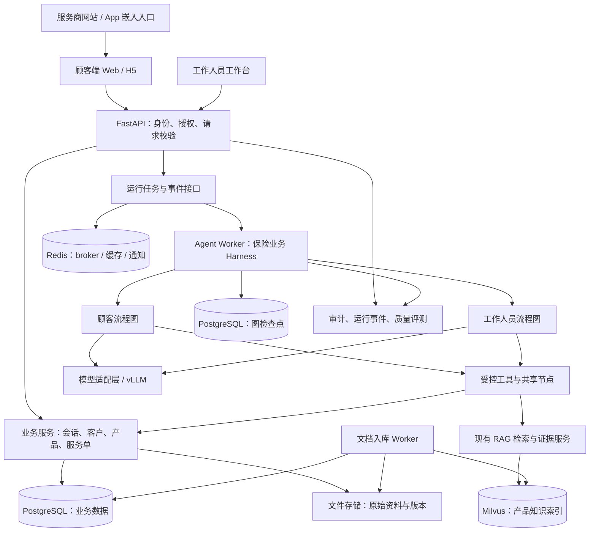
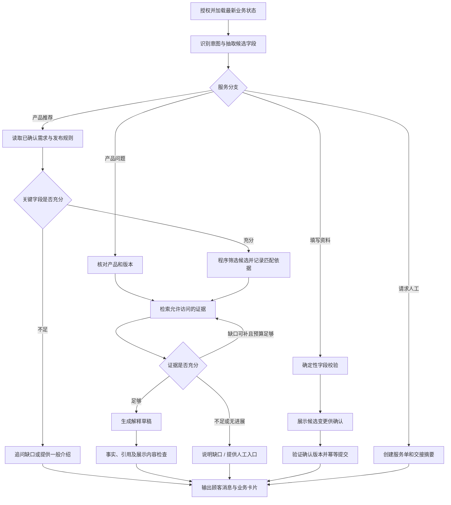

# 保险公司双端销售助手技术架构

设计日期：2026-10-08。状态：核心业务需求已明确，尚未实施。用户决定见需求确认记录；开发范围与默认行为以 [V1 开发规格](SALES_ASSISTANT_V1_SPEC.md) 为准。

本方案基于当前 InsureRAG 代码和顾客端咨询、需求采集、工作人员接续服务的目标。面向不同保险服务商、不限定单一险种，每家独立部署；第一版中国大陆，长期可扩展。目前暂无合作方，计划先开发再寻找试点。产品与表单按服务商配置；负载目标为 5 员工和 10 顾客同时使用。首版默认员工本地账号、顾客匿名会话，不依赖 CRM 或宿主 SSO。

需求澄清更新：交付目标为服务真实客户的业务试点。第一版覆盖介绍、采集和直接面向顾客的产品推荐，支持站内人工接待及后续跟进；顾客端提供独立网页并可嵌入服务商网站或 App，无须强制登录，入场表单全部选填且可跳过。基础需求与健康资料支持服务商配置；机构内工作人员可查看全部客户，也可维护并直接发布业务配置。人工接待采用公共列表主动接单；保留期限按机构配置。报价与投保仅预留模块边界，后续有需求再实现。详见 [需求确认记录](SALES_ASSISTANT_REQUIREMENTS.md)。

## 1. 核心决策

| 问题 | 建议 | 原因 |
| --- | --- | --- |
| LangGraph 还是 LangChain | LangGraph StateGraph 负责流程；按需使用 LangChain 模型、消息、工具与结构化输出接口 | 流程包含确定性校验、补查、等待确认和人工接手 |
| Harness 路线 | 参考 Codex 的运行机制，用 LangGraph 实现保险业务 harness；不直接嵌入或 fork Codex | 延续现有 Python 技术栈，业务权限、工具与流程由项目控制 |
| 是否重写现有 RAG | 保留检索服务，逐步抽取领域接口 | 复用 BGE-M3、Milvus、重排及解析能力 |
| 是否多 Agent | 第一版采用顾客与员工两套图入口，共享节点和服务 | 两端权限及输出不同，不需要多个自主 Agent 相互对话 |
| 是否微服务 | 模块化单体代码库，API 和 Worker 分进程 | 控制部署成本，隔离长任务 |
| 是否长期记忆 | 不建设 Agent 长期记忆；保留当前会话状态和经确认的业务资料 | 多轮咨询、人工交接与业务留档通过明确的数据模型实现，无需自动积累用户画像 |
| 核心数据库 | PostgreSQL | 保存业务事实、权限、任务、事件和图检查点；采用独立 schema/账号授权 |
| 向量库 | 沿用 Milvus | 主要索引发布的产品知识，避免迁移无关基础设施 |
| 缓存与队列 | Redis 缓存和队列 broker；Celery Worker；任务真相保存在 PostgreSQL | 任务可重试、可核验；Redis 不是客户档案唯一存储 |
| 模型 | 仅使用服务商本地模型，优先验证现有 vLLM/Qwen；必要时更换本地模型 | 不调用外部模型 API；文本生成可用不代表工具调用和信息抽取已达标 |
| 部署 | 每家服务商独立部署；建议容器、持久卷和备份 | 不建设共享 SaaS、机构自助入驻或跨机构控制台 |
| 地区 | 第一版中国大陆，其他地区保留扩展能力 | 其他地区不纳入第一版功能与验收 |
| 报价与投保 | 只预留模块边界，后续按需求实现 | 当前不接接口、不生成模拟报价、不展示可用投保入口 |

LangChain 当前 Agent 接口建立在 LangGraph 之上；LangGraph 也可以直接调用现有 Python 函数，无需整体改写成 LangChain Chain。[LangChain 官方说明](https://docs.langchain.com/oss/python/langchain/overview)、[LangGraph 官方说明](https://docs.langchain.com/oss/python/langgraph/overview)。

## 2. 系统组成



前端建议 React + TypeScript；顾客端和员工端可以共享组件库，但使用独立路由、接口响应模型和权限检查。现有简单网页可保留用于检索调试。

顾客端共用一套业务组件，提供独立页面与嵌入模式。建议网站以 iframe 容器、App 以 WebView 承载作为初始实现，具体宿主约束待确认；原生 App SDK 不作为默认范围。入口传入的产品和渠道标识由服务端校验，宿主传入的身份必须经可信流程验证，不能仅凭 URL 中的 customer_id 登录。

每套部署服务一家机构，数据、文件、索引及凭据独立配置。下文 tenant_id 作为机构范围标识使用，不意味着建设共享多租户 SaaS。报价与投保仅在目录与接口设计上预留扩展边界，不注册可执行工具、开放业务接口或添加模拟结果；CRM 是否接入另行确认。

一个 PostgreSQL 实例可以先承载业务库及 checkpoint schema，后续按规模隔离。原文先使用封装后的持久文件存储接口，适配客户对象存储时无需修改领域逻辑。禁止把原文只放在容器临时层。

### 2.1 Harness 的实现边界

参考 Codex 的上下文构建、工具执行、运行生命周期、审批、事件和失败反馈设计，用 LangGraph 实现本项目的执行流程。当前路线不引入 Codex SDK、App Server 或 Codex 源码依赖，也不另造通用 Agent 框架。

| 职责 | 实现位置 |
| --- | --- |
| 流程路由、有限循环、暂停及检查点恢复 | LangGraph 图及 checkpointer |
| 本轮输入装配、消息裁剪、当前服务事项资料和证据加载 | context_builder；不自动召回其他会话历史 |
| 工具白名单、参数校验、超时、结果裁剪 | tool_executor；复用现有领域服务 |
| 当前身份、资料访问、动作确认及运行预算 | policies；最终授权由业务服务强制执行 |
| 引用、结构化字段和顾客可见内容校验 | validators；校验失败有限重试或转人工 |
| 运行进度、工具结果、错误和审计事件 | events；双端分别裁剪可见内容 |

Harness 是后端内部模块，不新增独立部署服务。客户档案、服务单归属、确认记录及幂等写入由业务层管理；不能依赖模型提示词或图检查点代替这些约束。顾客图与员工图复用运行机制，分别配置工具权限和输出规则。

## 3. 双端授权边界

服务端通过身份系统生成 RequestContext：principal_id、tenant_id、actor_type、roles、scopes 和授权的业务对象范围。该上下文不由模型生成，不接受客户端声明管理员身份，也不从历史 checkpoint 直接恢复旧权限。

顾客可不登录。匿名入口由服务端签发有期限、不可预测的会话凭证，将访问权限绑定到本次会话及对应服务事项；工作人员仍需登录。入场表单的姓名、电话等内容为顾客提交的业务资料，不用作登录凭证，也不自动合并同名或同电话的历史客户。跨设备恢复方式另行确认。

入场资料表单统一显示，所有字段选填，顾客可以跳过直接进入。配置后台不得将入场字段改为必填；产品咨询过程中的条件追问和独立健康信息表单另行处理。

| 资源或动作 | 顾客 | 工作人员 |
| --- | --- | --- |
| 产品知识 | 已发布且允许顾客访问的资料 | 角色授权的公开及内部资料 |
| 客户资料 | 当前匿名会话或已验证身份获授权的资料 | 本机构全部客户资料 |
| 会话 | 当前会话凭证或已验证身份授权的顾客会话 | 本机构客户会话及各自获授权的员工辅助会话 |
| 内部备注 | 不返回 | 按岗位授权 |
| 产品解释 | 可查看 | 可核查和准备草稿 |
| 档案修改 | 确认自己的字段变更 | 根据岗位权限修改并留痕 |
| 顾客消息发送 | 提交自己的消息 | 明确发送动作、检查服务单归属和当前状态 |
| 调试 Trace | 不返回 | 只向授权运维或审计人员开放必要部分 |

顾客和员工使用不同的 graph_thread_id，通过 case_id 关联同一服务事项。顾客 DTO 必须白名单序列化，不能直接返回员工状态、完整 checkpoint 或原始工具结果。

工作人员可查看本机构全部客户，不等于任何人可同时回复同一会话。当前接待负责人、接单/转交和后台配置权限分别控制。机构外客户仍不可访问；默认内部备注在机构内共享，员工个人辅助会话仅本人可见。

用户已选择所有工作人员都能维护并直接发布产品、资料、表单和推荐条件，无管理员审核关卡。发布必须是明确的界面操作，记录操作人与配置版本，不能由聊天中的模型提议直接发布。部署管理员仅额外承担账号、运行配置和保留策略管理；该角色划分为开发默认值。

thread_id、case_id、customer_id 均是资源标识，不是访问凭证。每次检索、工具执行、事件订阅及恢复流程都重新授权。匿名咨询不自动绑定历史客户，登录后通过显式验证和归属检查关联，不能仅按姓名或电话文本合并。

## 4. 业务状态与图执行状态

业务状态由 PostgreSQL 中的 service_case 管理，例如：self_service、handoff_requested、queued、assigned、in_service、waiting_customer、closed。

图状态管理当前执行：最近消息、证据引用、待确认变更、问题缺口、剩余调用预算和当前节点。

两者分开：图的一次运行结束不代表客户服务已结束；工作人员接手也不意味着把顾客对话迁移到员工图。

建议图状态字段：

```text
conversation_id / case_id
recent_messages / summary_ref
product_version_ids / knowledge_revision
profile_revision / confirmed_fact_refs
pending_field_changes / missing_fields
evidence_refs / evidence_gaps
pending_action_id / expected_case_revision
retrieval_round / tool_calls / deadline
draft_response / validation_result / public_response
graph_version / prompt_version / model_version
```

身份和当前授权通过可信运行上下文注入。状态中的客户信息尽量使用引用；必须持久化的正文按敏感数据治理。不存储模型隐藏思维链，只记录执行动作、证据和简要判断结果。

## 5. 顾客流程图



普通对话每次输入触发一轮有限执行，输出后结束本轮。用户下一次回答再启动下一轮，不必为每个问题都设置长时间 interrupt。等待资料提交或草稿发布等明确动作审批时，可使用 interrupt；也可以由业务 pending_action 记录承接下一轮确认。

初始可配置上限：总检索轮数 3、工具调用数 8、运行期限 60 秒。它们是保护性设计初值，不是已验证的性能承诺。必要字段缺失时先询问，避免机械补查。无新增证据、重复工具调用或依赖服务失败时提前退出。

信息采集顺序由批准的 field schema 和条件规则控制，模型负责自然语言表达与候选抽取。正式问卷保存原问题、问卷版本、逐项回答及确认记录；模型不可自行删改问题。

第一版支持服务商配置基础需求和健康信息表单，分别定义字段类型、必填条件、适用产品、展示说明和版本。入场表单全部选填且可跳过；咨询过程中只有相关产品判断需要的字段才追问，缺失时不臆造确定结论。健康信息并不因支持配置而默认要求所有顾客填写。表单配置不等于已对接正式投保流程。

## 6. 工作人员流程与人工接手

员工图：加载授权服务事项 → 读取顾客确认资料 → 生成可核查摘要 → 标记缺口和矛盾 → 查询内部规则及产品 → 准备解释或回复草稿 → 等待工作人员决定下一步。

顾客图直接展示候选产品及推荐理由，不要求员工逐条审批推荐。任一工作人员可明确发布资料和规则，无另设审核人；发布前执行结构校验与来源检查。产品状态、适用条件及依据检查由服务端和图节点执行，信息不足时追问或交接。筛选和排序契约见 V1 规格。

第一版同时提供站内人工聊天和系统外后续跟进。后续跟进保存待办、联系结果及状态，不默认包含自动拨号、微信账号接入或自动发送消息。

人工接手由业务系统实现：

1. 在事务中创建或复用 service_case、记录交接摘要和 outbox 事件。
2. 人工请求进入本机构公共待接待列表，工作人员主动接单；多人抢单使用条件更新/版本检查，确保一个当前负责人。支持转交，其他员工仍可查看。
3. 工作人员接手后，顾客会话切换为人工服务模式。AI 可继续给员工建议，但不与人工同时自动回复顾客。
4. 新顾客消息仍能入库并送达负责人；排队超时、无人接手、重新分配有明确状态。
5. 结束或退回自助由明确动作触发，并展示给顾客。

LangGraph interrupt 可以等待外部输入，但分配、通知、排班、超时处理、实时聊天和权限都需要业务层实现。恢复时节点可能重新运行，写入必须具备幂等性。[官方 interrupts 文档](https://docs.langchain.com/oss/python/langgraph/interrupts)。

确认请求绑定 pending_action_id、payload_hash、数据版本、适用人和失效时间。用户只回复“好的”不能批准另一个已变化的动作。恢复前重新检查权限、产品状态、客户 revision 和审批内容；已过期的确认重新展示。

## 7. 会话状态与业务数据（不建设长期记忆）

当前范围不建设 Agent 长期记忆：不自动从聊天提炼永久偏好，不维护跨会话语义记忆库，不引入 LangGraph Store、专用记忆服务或客户聊天向量索引。当前会话、业务记录和产品知识分别管理。

| 层 | 内容 | 存储 | 第一版 |
| --- | --- | --- | --- |
| 当前上下文 | 本轮任务、最近消息、当前证据 | Graph State + 有预算的模型上下文 | 必须 |
| 会话持久化 | 同一会话的执行位置与状态 | PostgreSQL Checkpointer | 必须 |
| 客户业务资料 | 当前服务事项采集并确认的需求、联系方式及来源 | PostgreSQL 领域表 | 必须 |
| 会话历史和摘要 | 当前会话消息、按需生成的交接或压缩摘要 | PostgreSQL；摘要是派生数据 | 历史必需，摘要按需 |
| 产品知识 | 已发布条款、规则及版本 | 原文存储 + PostgreSQL + Milvus | 必须 |
| Agent 长期记忆 | 自动学习偏好、跨会话历史语义召回 | 不建设 | 不在范围内 |

Checkpointer 用于 thread 范围状态。同一会话可以跨天恢复；状态保存在数据库并不意味着引入跨会话长期记忆。[官方持久化说明](https://docs.langchain.com/oss/python/langgraph/persistence)。

业务资料通过领域服务，按经授权的 case_id/customer_id 精确查询。新会话默认不装载旧聊天或旧摘要；需要继续原服务事项时，经身份和归属校验显式关联该事项，读取最新业务记录。复用可变需求时重新核实，不根据模型推断自动关联客户。

### 7.1 业务资料的确认、更正与清理

候选信息 → 格式与业务校验 → 客户或具备权限的人员明确确认 → 更新业务档案并记录来源 → 使相关摘要和上下文失效。

每条事实至少记录 owner、field、value、source_message/form、confirmation_status、confirmed_by、confirmed_at、revision；可变事实增加适用时间或重新核实条件。

例如“今年预算大概五千”先作为待确认预算候选，不能直接变为长期固定收入或永久购买能力。替他人询问不能自动写入本人档案。员工推断和客户自述分开标识。

健康问卷、正式投保资料进入专门业务结构，避免压缩成模型自行概括的长期事实。过期需求在新服务事项中重新核实，不从旧聊天直接认定有效。

对业务档案、摘要、消息、checkpoint 和缓存分别确定更正、删除及保留规则，按请求和适用规则执行；备份采用明确的保留及恢复后再删除机制。防止旧检查点重放恢复已撤回信息。恢复节点重新读取权威档案和当前数据版本。

聊天、客户业务资料与健康资料的保留期限由服务商分别配置，提供人工删除及到期清理。生产配置不得将缺失保留策略静默解释为永久保存；开发默认值和部署前检查见 V1 规格。

### 7.2 上下文控制

模型输入由当前服务事项相关的已确认事实、本会话带出处的摘要、最近必要消息及当前证据组成。按 token 预算取用，不把所有历史聊天和所有条款都塞入 prompt，也不后台自动加载其他会话。

摘要不能替代正式问卷或原始回答；有矛盾时核查原文或询问。持久化全量消息不等于每次都发送全量消息。对消息、摘要和 checkpoint 分别设置访问、保留和清理策略。

## 8. 工具与模型职责

| 工具 | 数据来源 | 执行约束 |
| --- | --- | --- |
| list_available_products | 产品目录 | 机构、渠道、销售状态与访问范围过滤 |
| search_product_evidence | 现有 RAG | 在检索阶段落实 ACL、产品版本和发布状态 |
| get_clause_detail | 原文或统一条款服务 | 精确 document_version_id + parent_id，结果再授权 |
| compare_product_facts | 结构化属性 + 原文证据 | 标出未知和不一致，不能臆造缺失字段 |
| evaluate_product_candidates | 已确认字段 + 发布的规则版本 | 程序执行三态规则，缺失不算通过，输出匹配依据与待补字段 |
| get_confirmed_profile | 业务档案 | 顾客当前会话/已验证身份授权；员工本机构范围 |
| propose_profile_changes | 字段提取结果 | 只产生候选变更，不直接写确认事实 |
| commit_profile_changes | 已确认 pending_action | 确认版本、幂等键、事务及审计 |
| request_handoff | 服务单系统 | 幂等创建、明确状态、可查询结果 |
| create_followup_draft | 工作人员工作台 | 先生成待办草稿；执行写入按业务规则确认 |

报价与投保工具不属于当前工具集。未来具备需求及接入条件后，再确定接口契约和执行约束。

同一进程内优先调用 Python 领域服务。现有 MCP 保留为对外适配，避免内部调用先经过 HTTP/MCP 再回调自身。外部工具统一经过超时、授权、参数校验和结果裁剪。

模型负责意图识别、候选字段提取、查询改写、证据缺口评估及解释草稿。权限、必填判断、条件规则、金额计算、状态流转、实际写入由程序执行。

增加 ModelGateway，将文本生成、结构化输出、工具调用、超时与用量记录统一封装。当前 stage4_generate 的 prompt 面向条款问答，不直接复用于字段抽取、路由或审批。

模型调用仅连接服务商本地或机构内部网络的模型服务；生成、Embedding、重排及需要模型的 OCR 都采用本地实现，不默认使用外部模型作失败回退。评测和观测也不默认将客户正文发送到外部服务。本地模型服务故障时提示暂不可用或转人工，实际硬件和性能目标待确认。

目标负载为 5 名工作人员与 10 位顾客同时咨询，当前先在开发电脑实施。模型网关允许替换为小型或微调后的本地模型，不将训练流程纳入首版。现有配置为 Qwen3-8B-AWQ，尚未证明实际模型服务可用或当前硬件满足目标负载；生成请求应有有界队列和可配置并发上限。

部署前对实际模型、量化方式、vLLM 版本和启动参数做能力测试：中文意图、结构化 schema、缺失值、字段更正、tool call 参数、拒答和延迟。vLLM 的工具调用涉及模型适配与解析器设置，不能仅凭 OpenAI-compatible 接口认定全部可用。[vLLM 官方工具调用说明](https://docs.vllm.ai/en/latest/features/tool_calling/)。

若原生 tool calling 不稳定，第一版可以采用枚举动作 JSON + schema 验证 + 确定性分发；输出失败最多有限修复，再转澄清或人工。LangGraph 本身不依赖模型具有原生工具调用能力。

## 9. 数据实体和可靠执行

建议业务表：tenants、principals、memberships、customers、customer_facts、profile_change_requests、consent_records、products、product_versions、documents、document_versions、document_acl、conversations、conversation_messages、runs、run_events、service_cases、case_assignments、pending_actions、audit_events、outbox_events、ingestion_jobs。

独立 checkpoint schema 保存图运行状态；不增加 Store schema 或长期记忆数据表。业务事实以领域表为准。

关键约束：

- tenant_id 进入所有业务查询、唯一约束和事件访问检查。
- graph_thread_id 与 conversation、端类型及授权主体绑定；员工线程与顾客线程不共享原始 messages。
- 一个会话同一时刻一个可写运行；通过持久任务调度和数据库版本检查解决重复点击、断线重连及同时发言。
- message_id、run_id、command_id、outbox_event_id 提供幂等标识；外部系统若不支持幂等键，需要额外对账。
- 业务写入与 outbox 事件在同一数据库事务内；dispatcher 投递可重试，消费者按事件去重。
- Checkpointer 与业务数据库写入不假设存在跨组件原子事务。节点重放通过 command_id 查询已提交结果。
- graph_version 记录在运行中；升级时保留旧图运行、受控迁移或关闭后重建，不能让不兼容的新节点任意恢复旧 checkpoint。

通知只有在真实发送或分配成功后才标记完成。超时结果未知时先查执行状态，不直接重复调用产生重复预约或工单。

## 10. API 与事件契约（建议）

| 入口 | 接口示例 | 职责 |
| --- | --- | --- |
| 顾客 | POST /api/customer/conversations | 创建受归属控制的会话 |
| 顾客 | POST /api/customer/conversations/{id}/messages | 提交消息；返回 run_id |
| 顾客 | GET /api/customer/runs/{run_id}/events | SSE 读取公开事件；支持事件游标续读 |
| 顾客 | GET /api/customer/conversations/{id} | 恢复公开历史和业务卡片 |
| 顾客 | POST /api/customer/profile-changes/{id}/confirm | 确认已展示的字段变更 |
| 顾客 | POST /api/customer/conversations/{id}/handoff | 请求人工 |
| 员工 | GET /api/staff/cases | 查询本机构服务单，可按负责人和状态筛选 |
| 员工 | POST /api/staff/cases/{id}/claim | 条件更新方式接单 |
| 员工 | POST /api/staff/cases/{id}/assistant/messages | 在独立员工线程内请求辅助 |
| 员工 | POST /api/staff/cases/{id}/messages | 明确发送顾客可见回复 |
| 员工 | POST /api/staff/actions/{id}/approve | 对绑定版本的动作批准/驳回 |

API 层把经授权的确认转成图恢复事件，不暴露一个任何人都能传任意 thread_id 和 Command 的通用恢复端点。

事件可包括 progress、product_card、form_request、profile_confirmation、answer、citations、handoff_status、completed、error。顾客事件不带内部提示词、模型思维、员工备注或原始工具载荷。

顾客看到“正在核对条款”等简短进度；涉及产品事实的生成文本先检查，再发送最终答案或已审核片段，避免未经检查的 token 已展示后无法撤回。第一版人工聊天可复用 POST 消息提交与 SSE 事件订阅；SSE 断开不应重新创建运行，通过 run 状态和事件游标重连。顾客和员工的人工消息均需持久化、去重及按会话归属授权。是否需要 WebSocket 由在线状态等实际交互要求决定，不作为人工聊天功能的前提。

## 11. RAG 与知识生命周期改造

1. 将 rag_service 中的检索、条款读取接口抽象为 evidence_service，保持原测试和入口可回归。
2. 文档身份从文件名推导改为独立 ID；内容哈希用于去重，版本 ID 用于追溯。
3. 产品目录关联文档版本；检索前过滤权限、渠道和发布状态。
4. 上传、查询、详情读取使用一致的存储映射；补齐上传文档不在 chunks.json 的缺口。
5. 旁路构建索引，验证后切换知识版本；失败保留旧版。
6. 缓存键纳入知识版本、权限范围、模型及 prompt 版本；顾客个性化回答第一版不使用跨客户语义答案缓存。
7. 下架或权限撤销立即阻止查询，后台物理清理可重试；删除状态不能只以本地记录消失判定成功。
8. API 传入产品或文档业务 ID，不让前端任意指定底层 collection 作为权限范围。

## 12. 目录建议

以下为后续实施目录，不代表本次已经创建实现：

```text
agents/
  harness/
    context_builder.py  # 当前会话、服务事项资料与证据装配
    tool_executor.py    # 参数校验、执行、超时及结果裁剪
    policies.py         # 工具范围、确认要求和运行预算
    validators.py       # 字段、引用和输出检查
    events.py           # 运行事件与双端可见性
  customer_graph.py
  staff_graph.py
  state.py
  nodes/                 # 意图、候选抽取、检索、证据检查、输出检查
  tools/                 # 受控工具适配
  prompts/               # 不同任务的版本化提示词
domain/
  customers/
  products/
  conversations/
  cases/
services/
  evidence_service.py    # 逐步从现有 rag_service 抽取
  profile_service.py
  recommendation_service.py # 确定性规则与候选筛选
  case_service.py
  model_gateway.py
api/
  customer_routes.py
  staff_routes.py
  auth_context.py
infra/
  database.py
  checkpointer.py
  repositories/
  events/
workers/
  agent_tasks.py
  ingestion_tasks.py
  outbox_tasks.py
migrations/
frontend/
  customer/
  staff/
tests/
  graph/
  authorization/
  recovery/
  business_acceptance/
```

保持小规模模块边界，不为每个目录拆独立微服务。建议引入 langgraph、langgraph-checkpoint-postgres、PostgreSQL 驱动、SQLAlchemy/Alembic、Celery；复用已有 langchain-openai、Pydantic、FastAPI 和 Redis。安装时以实际兼容测试生成锁文件，不在设计阶段虚构精确版本。

## 13. 观测、测试和验收

保留已有 Trace 和 Metrics，但将 run_id、conversation_id、case_id、tenant_id、graph_version、prompt_version、model_version、knowledge_revision 串联起来。采集节点耗时、工具调用、补查次数、状态变化和错误；不默认将客户原文发送到外部观测平台。

关键测试：

- 顾客不能读取其他客户会话、员工备注、内部资料或事件流。
- 机构内员工可查看全部客户；机构外不可访问；客户可见范围不绕过当前接待负责人和后台配置权限。
- 匿名会话凭证只能访问对应会话；填写相同姓名或电话不自动合并客户或恢复历史。
- 模型抽取字段只形成候选；未经确认不能写为正式事实。
- 同一消息、确认和工单重复提交不重复执行。
- Worker 崩溃或恢复重放不重复发送、不重复创建业务记录。
- 员工接手后机器人不会同时对顾客自动回复。
- 两名员工同时接单只产生一个当前负责人。
- 客户更正或撤回信息后，摘要、缓存和旧 checkpoint 不继续使用旧事实。
- 新会话不自动加载其他会话历史；显式继续原服务事项时重新校验归属、权限和资料版本。
- 产品版本变化后，过期引用或待批准草稿触发重新核对。
- 文档内指令不能扩大工具权限、触发业务写入。
- 工具失败、结构化输出错误、检索无结果能有限退出。
- 图升级后的旧运行有明确兼容或迁移策略。

评测应读取同一次真实运行的答案与证据，修正现有 collect_all_data 二次检索的问题。分别评估事实与引用、字段抽取与更正、采集完成率、人工交接完整性、延迟与每个有效任务成本。容量和 SLO 在目标硬件、负载及客户需求明确后确定。

## 14. 实施顺序

| 阶段 | 工作 | 验收结果 |
| --- | --- | --- |
| A | PostgreSQL、身份上下文、产品版本、基础会话与档案表 | 可区分顾客/员工，业务数据权限可测 |
| B | 轻量 harness、顾客图、模型适配、受控 RAG 工具、持久检查点、公开事件 | 多轮产品咨询、执行边界和重启恢复 |
| C | schema 驱动采集、候选字段、确认及修订 | 信息可检查、可确认、可更正 |
| D | 服务单、员工图、摘要、接单、站内人工聊天及后续跟进 | 顾客信息可交接，人工消息可续读，内部内容不外泄 |
| E | 文档 Worker、outbox、缓存失效、重放测试、发布与恢复 | 可受控试点，关键故障路径可验证 |
| F | 根据试点需求评估 CRM，并优化产品知识和采集流程 | 扩展功能有业务收益与质量证据 |

A—E 是试点前的相互依赖建设项，不表示前一阶段单独完成就可公开上线。本方案不安排长期记忆建设阶段；会话续接、资料留档和人工交接通过会话状态与结构化业务记录完成。

报价与投保不列入本轮实施阶段，只预留未来模块位置，待用户提出具体需求后再设计和实施。

## 15. 官方参考与本次验证范围

框架资料核对日期：2026-10-08。以下为官方能力说明，具体产品边界与数据模型是本方案的设计建议。

- [LangGraph overview](https://docs.langchain.com/oss/python/langgraph/overview)
- [LangChain overview](https://docs.langchain.com/oss/python/langchain/overview)
- [Persistence](https://docs.langchain.com/oss/python/langgraph/persistence)
- [Checkpointers](https://docs.langchain.com/oss/python/langgraph/checkpointers)
- [Interrupts](https://docs.langchain.com/oss/python/langgraph/interrupts)
- [vLLM Tool Calling](https://docs.vllm.ai/en/latest/features/tool_calling/)
- [Codex harness 官方架构说明](https://developers.openai.com/blog/codex-as-a-platform)
- [Codex App Server 协议参考](https://learn.chatgpt.com/docs/app-server)

本次仅更新设计文档；Codex 参考依据为官方架构说明与协议，尚未逐模块审查源码。没有安装依赖、更换模型、修改运行接口或完成吞吐、恢复、权限测试。
